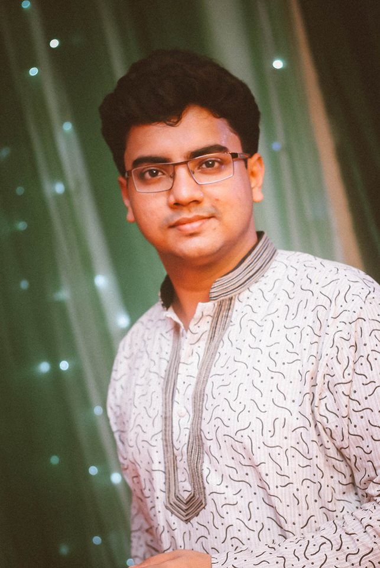

  <section class="hero">
    
    

      <h1>Md. Mahmudul Haque</h1>
      
Data Scientist • NLP & Computer Vision • M.Sc. Data Science @ TU Dortmund

      

        I build practical machine learning products, from NLP pipelines and summarization APIs to
        computer vision systems deployed on cloud and edge devices.
      

      

        <a href="https://www.linkedin.com/in/md-mahmudul-haque-8a5484b2">LinkedIn</a>
        <a href="https://github.com/alcatraz47?tab=repositories">GitHub</a>
        <a href="https://medium.com/@arfanmahmud47/has-recommended">Medium</a>
        <a href="https://www.facebook.com/mahmud.arfan.alcatraz47">Facebook</a>
      

    

  </section>

  <section class="grid">
    <article class="card">
      <h2>About</h2>
      

        Data science practitioner with 5+ years of research and industry experience.
        Strong interest in <strong>Natural Language Processing</strong>, with hands-on delivery across
        MLOps, APIs, model optimization, and production integration.
      

    </article>

    <article class="card">
      <h2>Current Role</h2>
      <ul>
        <li>Data Science Working Student / Intern at <strong>Henkel AG & Co. KGaA</strong>, Düsseldorf</li>
        <li>M.Sc. in Data Science at <strong>Technical University Dortmund</strong></li>
      </ul>
    </article>

    <article class="card">
      <h2>Past Experience</h2>
      <ul>
        <li>Software Engineer (Part-time), Proxify AB (2023–2024)</li>
        <li>Data Scientist & Engineer, Eucaps Ltd. (2021–2022)</li>
        <li>Machine Learning Engineer, NybSys Pvt. Ltd. (2019–2021)</li>
      </ul>
    </article>

    <article class="card">
      <h2>Core Skills</h2>
      <ul>
        <li>Python, PyTorch, FastAPI, Spark, SQL</li>
        <li>NLP (summarization, text classification), Speech processing</li>
        <li>Computer Vision (detection, recognition, tracking)</li>
        <li>AWS (S3, Lambda, SageMaker, Redshift), Azure</li>
      </ul>
    </article>

    <article class="card full">
      <h2>Selected Projects</h2>
      <ul>
        <li><strong>Financial News Summarization:</strong> Built English news summarization pipeline and API for SMEs in Europe.</li>
        <li><strong>FaceNext:</strong> Contributed to face recognition-based access control system for web/mobile with cloud + edge deployment.</li>
        <li><strong>Emotion Recognition from Voice:</strong> Built deep learning pipeline using MFCC/Mel features and sequential models.</li>
        <li><strong>Rice Disease Detection:</strong> Capstone project with custom CNN + ResNet variants for disease classification.</li>
      </ul>
    </article>

    <article class="card">
      <h2>Publication</h2>
      

        <strong>Data Mining Techniques to Categorize Single Paragraph Formed Self Narrated Stories</strong> 
        ICT4SD, 2020.
      

    </article>

    <article class="card">
      <h2>Recognition</h2>
      

        8th place at Team Contest of <strong>NeurIPS AutoDL Challenge</strong>
        (Auto Speech Challenge), co-hosted by Google, Cha-Learn, and 4Paradigm.
      

    </article>

    <article class="card full">
      <h2>Interests</h2>
      
Travelling • Listening to music • Reading fiction • Formula 1

    </article>
  </section>

